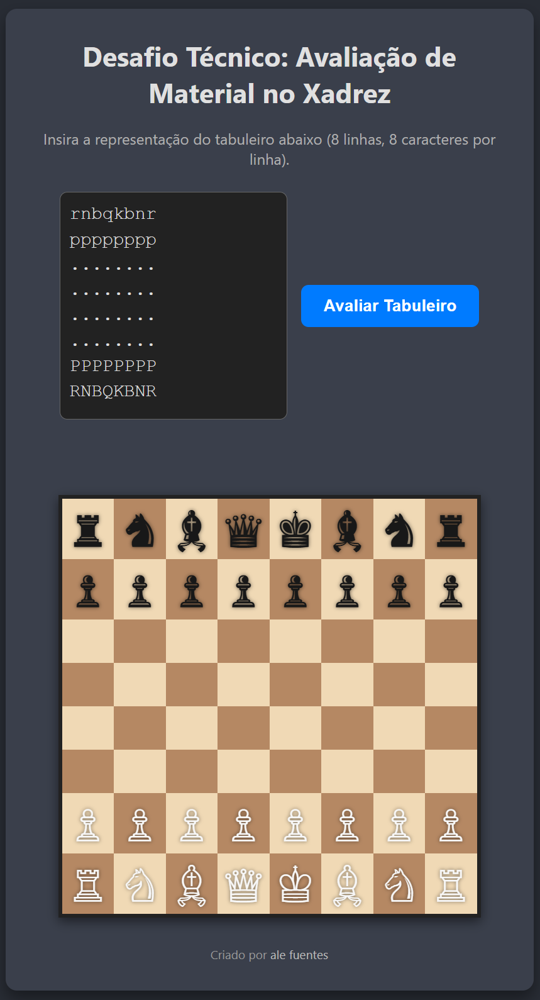

```
(\ (\
( • •)  
━∪∪━━━━ 
ᵇʸ ᴬˡᵉᶠᵘᵉⁿᵗᵉˢ 
```
# Desafio Técnico: Avaliador de Material de Xadrez ♟️
 •  


Este projeto é uma aplicação web que calcula o valor total do material presente em um tabuleiro de xadrez para as peças brancas e pretas, determinando qual lado está em vantagem material.

A aplicação possui um backend em **Node.js com Express** para a lógica de cálculo e um **frontend em HTML, CSS e JavaScript** para a interface do usuário, onde é possível inserir a posição do tabuleiro e visualizar o resultado e o tabuleiro graficamente.



---

## ✅ Funcionalidades

*   **Entrada de Texto**: Permite inserir a configuração do tabuleiro no formato de 8 linhas e 8 caracteres.
*   **Cálculo de Pontuação**: Processa o tabuleiro e calcula a pontuação para as brancas e pretas com base nos valores padrão das peças.
*   **Análise de Vantagem**: Informa qual jogador está em vantagem material ou se a posição é igual.
*   **Visualização Gráfica**: Renderiza um tabuleiro de xadrez visual com as peças na posição inserida, usando caracteres Unicode.

---

## 🛠️ Tecnologias Utilizadas

*   **Backend**: Node.js, Express.js
*   **Frontend**: HTML5, CSS3 (com Flexbox e Grid), JavaScript (ES6+ com Fetch API)
*   **Ambiente**: Git, npm

---

## ⚙️ Como Executar o Projeto Localmente

Siga os passos abaixo para configurar e rodar a aplicação em sua máquina.

### Pré-requisitos

*   [Node.js](https://nodejs.org/) (versão 14 ou superior)
*   [npm](https://www.npmjs.com/) (geralmente instalado com o Node.js)
*   [Git](https://git-scm.com/)

### Passos

1.  **Clone o repositório:**
    ```bash
    git clone https://github.com/ale-fuentes-ar/cap-desafio-251006
    ```

2.  **Navegue até a pasta do projeto:**
    ```bash
    cd cap-desafio-251006
    ```

3.  **Instale as dependências do backend:**
    ```bash
    npm install
    ```

4.  **Inicie o servidor:**
    ```bash
    node server.js
    ```

5.  **Abra a aplicação no seu navegador:**
    Acesse [`http://localhost:3000`](http://localhost:3000)

---

## 🧮 Valores das Peças

| Peça    | Símbolo | Valor |
| :------ | :-----: | :---: |
| Peão    |  `P/p`  |   1   |
| Cavalo  |  `N/n`  |   3   |
| Bispo   |  `B/b`  |   3   |
| Torre   |  `R/r`  |   5   |
| Rainha  |  `Q/q`  |   9   |
| Rei     |  `K/k`  |   0   |

---
## 📥 Formato da Entrada

A entrada deve ser um texto de 8 linhas, onde cada linha contém 8 caracteres.
*   **Peças Brancas**: Letras maiúsculas (`P`, `N`, `B`, `R`, `Q`, `K`)
*   **Peças Pretas**: Letras minúsculas (`p`, `n`, `b`, `r`, `q`, `k`)
*   **Casas Vazias**: Espaço (` `) ou ponto (`.`)

### Exemplo de Entrada

```text
rnbqkbnr
pppppppp
........
........
........
........
PPPPPPPP
RNBQKBNR
```

### Exemplo de Saída

```text
equal 39 39
```